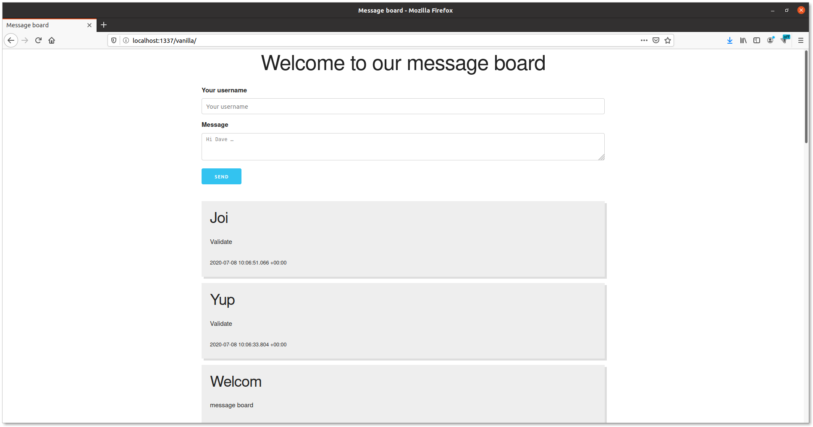

# Message board app

[Trello board](https://trello.com/b/YW9WzOrw/message-board-app)

### Frontend (Vanilla JS)

- skeleton css
- Vanilla JS
- Static HTML

### Backend

- express
- morgan
- cors
- sequelize
- sqlite3
- yup (data validation)

### API

- `GET: /messages` - list of messages
- `POST: /messages` - insert message
- `DELETE: /messages` - delete message

### Database

- sqlite
